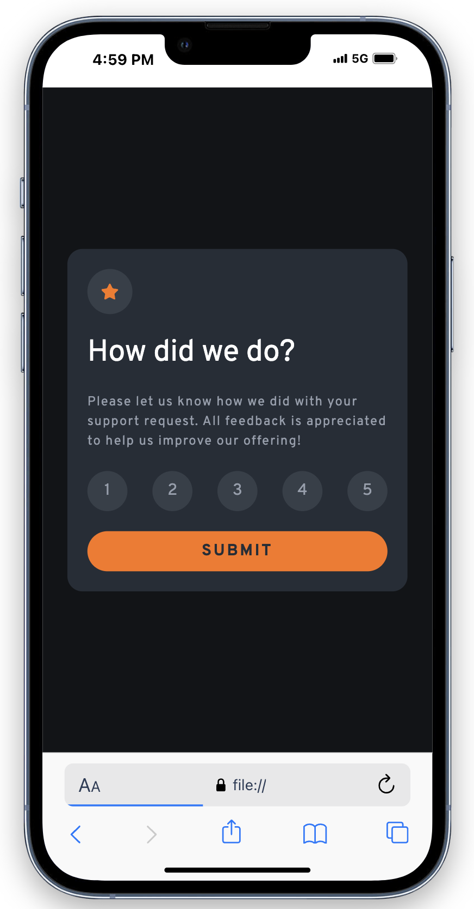
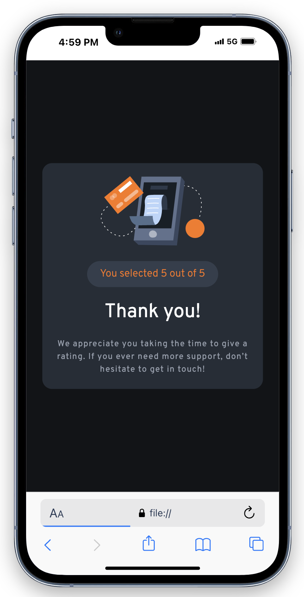
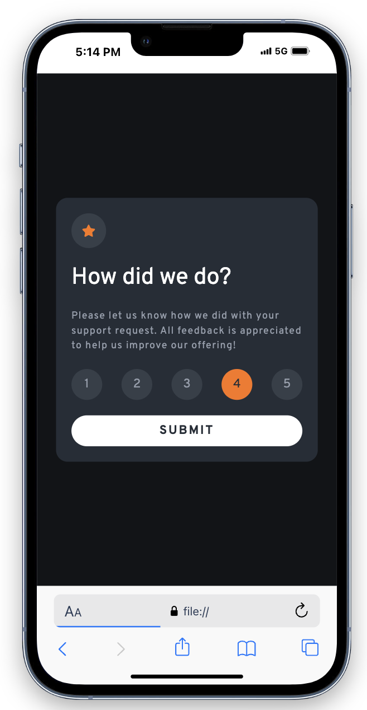

This is a my solution to the Interactive rating component challenge from [Front End Mentor](https://www.frontendmentor.io/)

## Overview
Users should be able to:

- View the optimal layout for the app depending on their device's screen size
- See hover states for all interactive elements on the page
- Select and submit a number rating
- See the "Thank you" card state after submitting a rating

### Built with

- Semantic HTML5 markup
- CSS custom properties
- Flexbox
- Google Fonts
- JavaScript

### Screenshot

